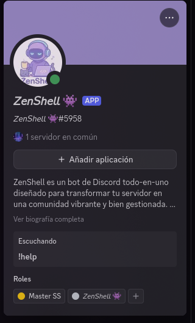

# ZenShell Bot

ZenShell es un bot de Discord todo-en-uno diseñado para transformar tu servidor en una comunidad vibrante y bien gestionada. Con funcionalidades avanzadas de moderación, un sistema de economía completo, reproducción de música, niveles personalizados y mucho más, ZenShell se adapta a las necesidades de cualquier servidor.



## Características Principales

### Sistema de Moderación
- **Comandos de Moderación**: Ban, kick, mute, warn, clear y más.
- **Registro de Actividad**: Seguimiento detallado de todas las acciones de moderación.
- **Auto-Moderación**: Filtrado de palabras, anti-spam y protección contra enlaces maliciosos.
- **Sistema de Tickets**: Gestión de soporte y ayuda para los usuarios.
- **Gestión de Roles**: Comandos para añadir, quitar, crear, eliminar y listar roles.
- **Roles Automáticos**: Asignación automática de roles basada en niveles de usuario.

### Sistema de Niveles y Economía
- **Sistema de XP**: Los usuarios ganan experiencia al participar en el servidor.
- **Niveles Personalizables**: Configura los requisitos de XP para cada nivel.
- **Recompensas por Nivel**: Otorga roles y monedas automáticamente al subir de nivel.
- **Monedas del Servidor**: Economía virtual con comandos para ganar, transferir y gastar monedas.
- **Tienda del Servidor**: Compra de roles, items y ventajas con las monedas del servidor.
- **Comandos de Apuestas**: Sistema de apuestas con diferentes probabilidades de ganar.
- **Comandos Personalizados**: Los usuarios pueden crear y usar comandos personalizados.

### Sistema de Logros y Estadísticas
- **Logros Desbloqueables**: Más de 20 logros basados en la actividad del usuario.
- **Perfiles de Usuario**: Muestra nivel, XP, monedas, logros y estadísticas.
- **Tablas de Clasificación**: Rankings de usuarios por nivel, mensajes y logros.
- **Estadísticas del Servidor**: Información detallada sobre la actividad del servidor.

### Música y Entretenimiento
- **Reproducción de Música**: Reproduce música de YouTube, Spotify y otras plataformas.
- **Cola de Reproducción**: Gestión completa de la cola con comandos para añadir, eliminar y reordenar canciones.
- **Controles de Reproducción**: Pausa, reanudación, salto, volumen y más.
- **Efectos de Audio**: Ecualizador, bass boost y otros efectos.
- **Letras de Canciones**: Muestra las letras de las canciones que se están reproduciendo.

### Utilidades
- **Recordatorios**: Programa recordatorios para ti o para el servidor.
- **Encuestas**: Crea encuestas interactivas con múltiples opciones.
- **Sorteos**: Organiza sorteos con requisitos personalizables.
- **Saludos Automáticos**: Mensajes de bienvenida y despedida personalizables.
- **Estado Personalizable**: El bot muestra diferentes estados que pueden ser configurados.

## Comandos

ZenShell cuenta con más de 60 comandos organizados en 15+ categorías. Algunos de los comandos más útiles son:

### Moderación
- `!ban <usuario> [razón]` - Banea a un usuario del servidor.
- `!kick <usuario> [razón]` - Expulsa a un usuario del servidor.
- `!mute <usuario> [duración] [razón]` - Silencia a un usuario.
- `!clear <cantidad>` - Elimina un número específico de mensajes.
- `!addrole <usuario> <rol>` - Añade un rol a un usuario.
- `!removerole <usuario> <rol>` - Quita un rol a un usuario.

### Niveles y Economía
- `!level` - Muestra tu nivel actual y XP.
- `!level_leaderboard` - Muestra el ranking de niveles del servidor.
- `!daily` - Reclama tu recompensa diaria de monedas.
- `!balance` - Muestra tu balance de monedas.
- `!pay <usuario> <cantidad>` - Transfiere monedas a otro usuario.
- `!shop` - Muestra la tienda del servidor.
- `!buy <item>` - Compra un item de la tienda.
- `!gamble <cantidad>` - Apuesta monedas con posibilidad de ganar más.

### Logros y Estadísticas
- `!profile` - Muestra tu perfil completo.
- `!achievements` - Muestra tus logros desbloqueados.
- `!leaderboard` - Muestra el ranking de logros del servidor.
- `!stats` - Muestra estadísticas detalladas del servidor.

### Música
- `!play <canción>` - Reproduce una canción o la añade a la cola.
- `!skip` - Salta a la siguiente canción en la cola.
- `!queue` - Muestra la cola de reproducción actual.
- `!pause` - Pausa la reproducción actual.
- `!resume` - Reanuda la reproducción pausada.
- `!stop` - Detiene la reproducción y limpia la cola.
- `!volume <1-100>` - Ajusta el volumen de reproducción.

### Utilidades
- `!help [comando]` - Muestra la lista de comandos o información sobre un comando específico.
- `!remind <tiempo> <recordatorio>` - Programa un recordatorio.
- `!poll <pregunta> <opciones...>` - Crea una encuesta.
- `!giveaway <tiempo> <premio>` - Inicia un sorteo.
- `!status <tipo> <texto>` - Cambia el estado del bot (solo administradores).

## Configuración

### Requisitos
- Python 3.8 o superior
- Discord.py 2.0 o superior
- Base de datos Supabase

### Variables de Entorno
Crea un archivo `.env` en la raíz del proyecto con las siguientes variables:
```
DISCORD_TOKEN=tu_token_de_discord
URL_SUPABASE=tu_url_de_supabase
SUPABASE_KEY=tu_clave_de_supabase
```

### Instalación
1. Clona el repositorio:
```bash
git clone https://github.com/tu-usuario/Bot-Discord.git
cd Bot-Discord
```

2. Instala las dependencias:
```bash
pip install -r requirements.txt
```

3. Configura la base de datos Supabase:
   - Crea una cuenta en [Supabase](https://supabase.io/)
   - Crea un nuevo proyecto
   - Crea las tablas necesarias (users, messages, achievements, etc.)
   - Obtén la URL y la clave de API

4. Inicia el bot:
```bash
python main.py
```

## Ejecución Continua
Para mantener el bot en ejecución constante, puedes usar la aplicación Flask incluida:
```bash
python app.py
```
Esto iniciará un servidor web simple que mantendrá el bot activo y permitirá monitorearlo.

## Licencia
Este proyecto está bajo la Licencia MIT. Consulta el archivo LICENSE para más detalles.

## Contacto
Si tienes alguna pregunta o sugerencia, no dudes en abrir un issue en GitHub o contactarme directamente.
